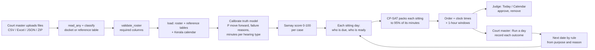
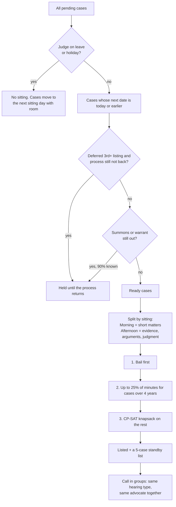
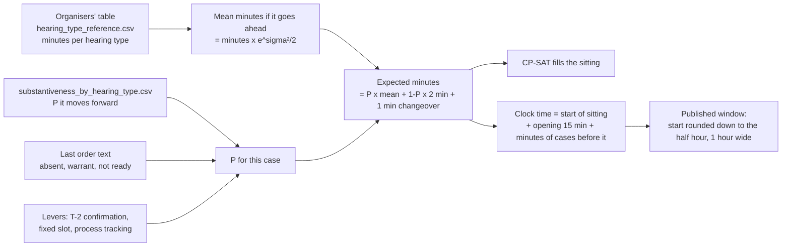

# Samay: engineer handoff

Samay builds a judge's daily cause list from the docket. It is built only on the hackathon's real data
(Kerala magistrate court, 100 NI Act s.138 cheque cases, plus the organisers' reference tables).

Read this first, then `docs/HOW_IT_WORKS.md` (every stage) and `docs/PRIORITY_SCORE.md` (the score).

## 1. Run it

```bash
python3 -m venv .venv && .venv/bin/pip install -r requirements.txt
.venv/bin/streamlit run app.py          # http://localhost:8501
.venv/bin/python scripts/run_pucar.py   # the A/B results, 5 seeds, 60 working days
.venv/bin/python scripts/run_one_judge.py   # one judge, a year
```

Sign in as Judge (Justice Sehgal's docket is pre-loaded from `data/pucar/roster_sample_100.csv`)
or as Court master.

## 2. Where things are

| Path | What it is |
|---|---|
| `app.py` | Entry. `st.navigation` with three hidden pages: login, judge, court master |
| `pages/login.py` | Role and name, then `st.switch_page` |
| `pages/judge.py` | Side-panel menu: Today, Calendar, Cases, Priority, Insight. The judge can mark a hearing Heard or the case Disposed, which fixes it |
| `pages/court_master.py` | Tabs: Judges, Files, Run a day, New complaint |
| `pages/shared.py` | CSS, sidebar, dockets per judge, file reading (CSV, Excel, JSON, ZIP), `plans()` cache, cause-list table |
| `core/pucar_engine.py` | Loads the data, calibrates the truth model, simulates days, packs each sitting with CP-SAT |
| `core/priority.py` | The Samay 5-factor priority score (0 to 100) |
| `core/registry.py` | Scrutiny of a new s.138 complaint: statutory timeline, documents, summons details |
| `config/pucar.yaml` | Every number the engine uses: sitting blocks, levers, gaps, leave, quota, clock |
| `config/calendar.yaml` | Official Kerala High Court 2026 holidays and vacations |
| `config/registry_ni138.yaml` | Registry rules for s.138 complaints |
| `data/pucar/` | The organisers' CSVs (roster, hearing types, substantiveness, failure reasons, calendar, sample cause list) |
| `data/pucar_out*/` | Saved results at 330 and 420 minutes a day |
| `scripts/` | Results runner, one-judge year, data profile, roster generator |
| `archive/` | Old synthetic High Court version. Not used. Safe to ignore |

Nothing is hard-coded in the pages: every number comes from `config/*.yaml` or the data files.

## 3. The whole flow



## 4. How one day is scheduled



The value CP-SAT maximises for each case:

```
value   = (Samay score + listing boost + s.143 boost) x P(this hearing moves the case)
ranking = value / expected_minutes ^ 0.25
```

- Listing boost: 1st listing +0, 2nd +10, deferred (3rd+) +25 (`config/pucar.yaml` escalation).
- s.143 boost: +15 while the case is under 180 days old (NI Act s.143(3), finish in six months).
- The objective is `sum(value x minutes^0.75)` under `sum(expected minutes) <= 95% of the sitting`.
  A 1-second limit, 8 workers; the day is solved optimally well under that.
- Code: `_pack()` in `core/pucar_engine.py`.

## 5. The Samay priority score

| Factor | Points | What it measures |
|---|---|---|
| Case age | 35 | Years since filing; full points at 8 years (mean + 2 sd of this docket) |
| Hearing readiness | 25 | Who was present at the last hearing against who this hearing needs |
| Disposal proximity | 15 | How far along the 11 stages the case is |
| Hearing churn | 15 | Hearings held against the expected number for its stage |
| Court-set urgency | 10 | "Last chance", "day to day", "peremptory" in the last order |

A case with a summons, warrant or notice still out is Conditional, not Eligible. The judge can move the
weights on the Priority tab; age never drops below 20. Real scores: ST/1261/2017 91.3, ST/608/2017 69.9,
ST/1166/2023 40.9, ST/7/2025 12.5, ST/293/2026 7.2. Code: `core/priority.py`.

## 6. How we know how long a hearing takes



1. **Base minutes per hearing type** come from the organisers' `hearing_type_reference.csv`:
   Admission 5, Delay condonation 5, Cognizance 10, Appearance 10, Warrant 10, Reports 10,
   Application review 10, Plea 15, Bail 15, Examination s.351 30, Evidence (both sides) 30,
   Arguments 30, Judgment 30.
2. **Real hearings vary.** Actual minutes = base x lognormal noise, sigma 0.35
   (`duration_sigma`). The mean of that is base x e^(0.35²/2) = base x 1.063.
3. **Not every listed case is heard.** P(moves forward) starts from the organisers' substantiveness
   table (Plea 90%, Admission 49%, Evidence complainant 29%, Arguments 13%...), is raised or lowered by
   the last order (text signals, x2.5 risk, normalised so the type average holds), and by the levers.
   A case that is called and adjourned still costs 2 minutes. Every case costs 1 minute to call
   (3 when the hearing type changes).
4. **Expected minutes** = P x base x 1.063 + (1 - P) x 2 + 1.

   Worked example, Evidence complainant, base 30, P = 0.50: 0.50 x 31.9 + 0.50 x 2 + 1 = **17.9 min**.
   Admission, base 5, P = 0.60: 0.60 x 5.3 + 0.40 x 2 + 1 = **5.0 min**.
5. **Room in the day.** Morning 10:30 to 12:30 = 120 min, less 15 min opening (pronouncements,
   mentions) = 105. Afternoon 13:30 to 17:00 = 210. Lunch 12:30 to 13:30. The packer fills 95% of each
   (99.75 and 199.5), which leaves slack for the long tail of durations.
6. **Clock time** for each case = start of its sitting + opening + expected minutes of the cases called
   before it. The party is given a 1-hour window starting at the half hour before
   (e.g. expected 11:16 → window 11:00 to 12:00).
7. **When the day runs over**, cases not reached go to the next sitting day (1 day, not 60); if the day
   runs short, the standby list (5 cases per sitting) is called.
8. **It learns.** Each outcome the court master records is the input the rates come from; with real
   recorded outcomes the minutes and P values are recomputed from them rather than from the reference table.

## 7. The next date, by rule

| Outcome | Next date |
|---|---|
| Moved forward | The next purpose's gap from the organisers' table (5 to 45 days) |
| Summons or warrant not back | 21 days, or the day the process returns |
| A party absent | 7 days |
| Not ready | 10 days |
| Court could not reach it | Next sitting day |
| Adjourned, unclear | 7 days |
| Today's rules (baseline) | Flat 60 days |

## 8. Results (60 working days, 330 min a day, 5 seeds)

| Measure | Today's rules | Samay |
|---|---|---|
| Listed cases the court reaches | 44% | 97% |
| Heard cases that move forward | 48% | 79% |
| Cases over 4 years heard at least once | 32% | 47% |
| Days from listing to a real hearing | 23 | 2 |
| Average gap to the next date | 60 | 14 |
| Cases disposed | 196 | 356 |
| Wasted listings | 2,694 | 259 |

## 9. What to build next

1. Replace the simulated outcomes with recorded ones (a database behind "Run a day"; Streamlit
   session state today).
2. Real process-return status from the process server and e-summons.
3. Sign-in against the court's user store; today it is a name picker.
4. A link judge on leave days for bail.
5. Per-bench config files (hours, blocks, leave register, weights).
6. SMS or WhatsApp windows to parties two days before.

## 10. Checks before you change anything

- `docs/PRIORITY_SCORE.md` lists the five real scores above; they must not move unless the spec does.
- `scripts/run_pucar.py` must still reproduce today's rules at about 60 listed, 20 heard, 10 moving
  forward a day (the case study's numbers).
- No em or en dashes in the UI text.
