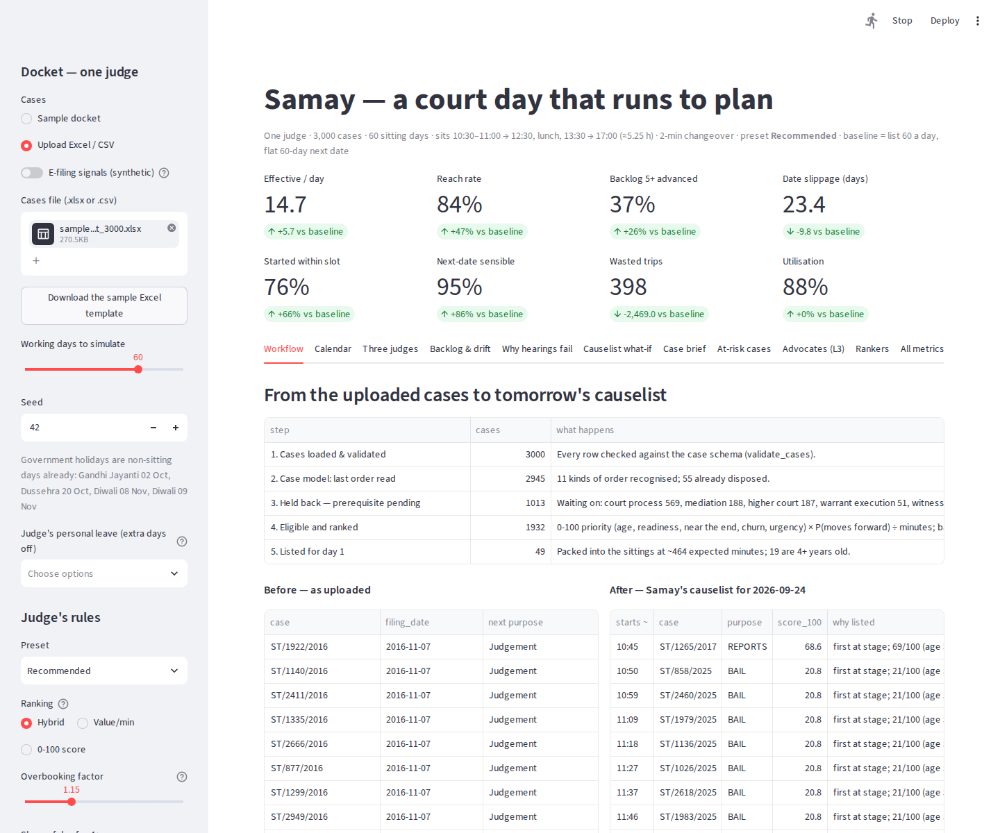
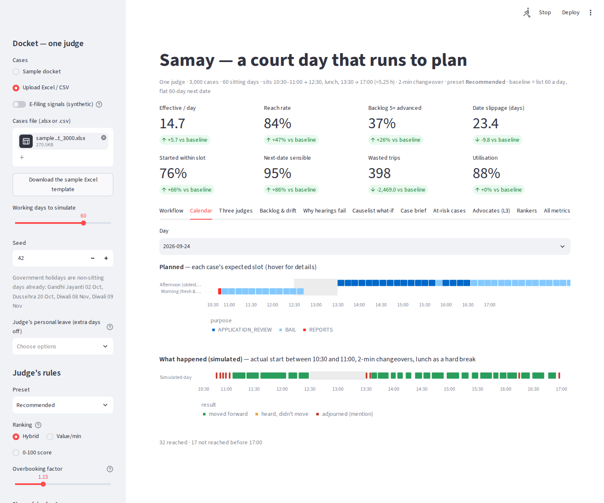
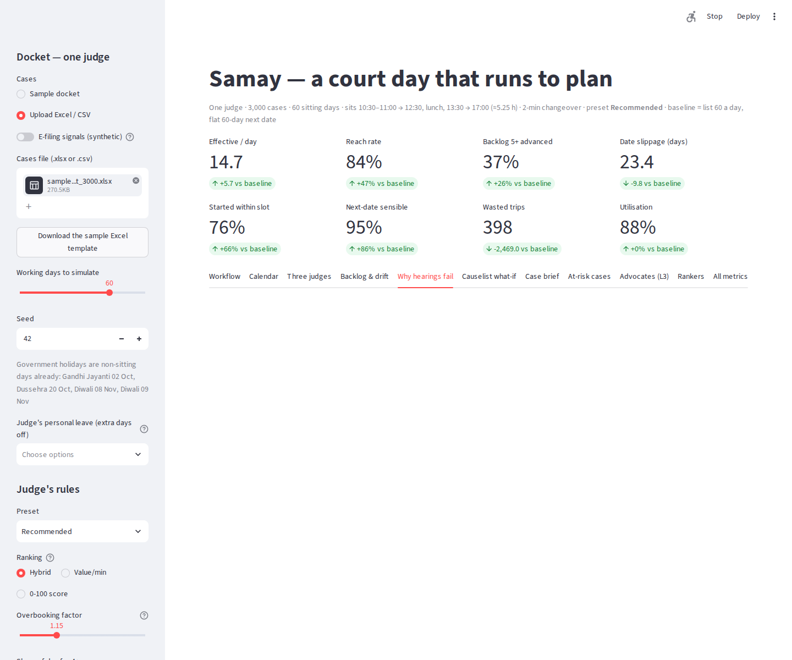
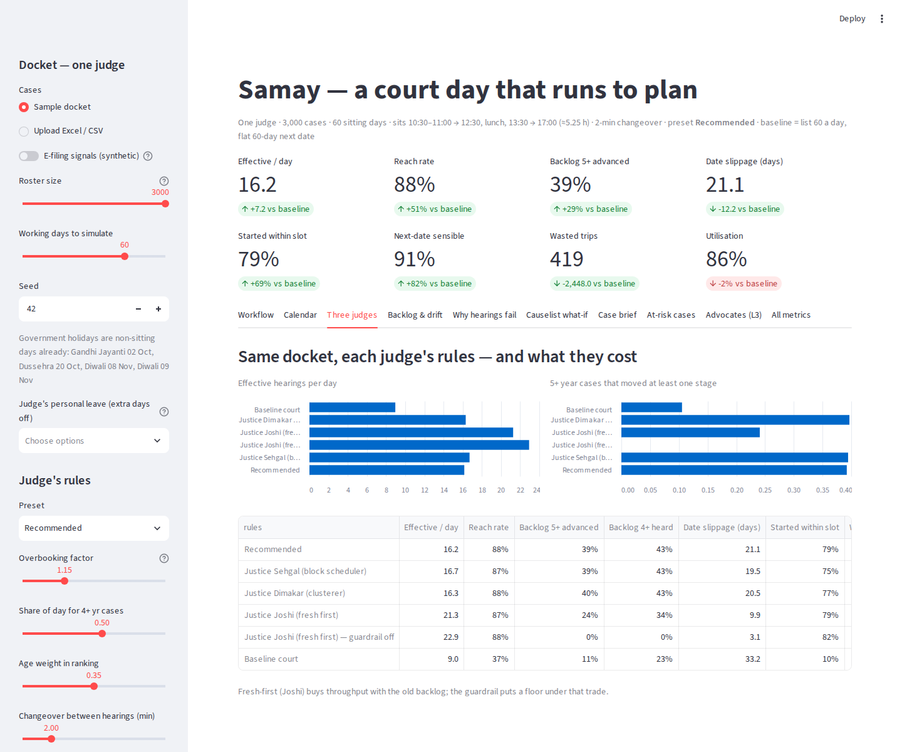

# Submission: samay

## 1. Team

- **Team / solo name:** samay
- **Members:** Guruprasad Meena, _add teammates_
- **Complexity level claimed:** **L3** — behavioural advocate agents on top of a full L2 model (§4)

## 2. One-line summary

For one judge's cheque-bounce docket, Samay lists only hearings that are ready to happen and likely to move the case forward, packs them into the court's real sittings with time slots, guarantees ageing cases a share of every day, and matches each next date to the work the next step needs — turning a 60 → 12 → 8 day into 21 → 15 → 14, finishing 3.3× as many cases (419 vs 127 in 60 days) with a seventh of the wasted trips.

## 3. The approach

**Scope.** One judge, cheque-bounce (s.138 NI Act) cases only — the only case type with data. The engine is per judge by design: every rule lives in that judge's config, so a court runs one instance per courtroom (§6).

**Inputs.** All six files in `data/`. Cases can also be **uploaded as an Excel or CSV file** in the dashboard (`samples/sample_cases.xlsx` is the 100-row template, `samples/sample_docket_3000.xlsx` a full docket); the workflow then runs on that file. The 3,000-case docket comes from `scripts/generate_roster.py` (bootstrap resample of the 100 — "more of the same mix"; advocate IDs redrawn, so advocate clustering at 3,000 is synthetic). Optional synthetic e-filing columns via `src/efiling.py`.

**Court day.** The bench starts anywhere between 10:30 and 11:00, breaks for lunch 12:30–13:30, and rises at 17:00 — about 315 sitting minutes. Every hearing is followed by a changeover (calling the case, parties stepping up) averaging **2 minutes**, which costs about 40 minutes a day. Government holidays are non-sitting days; the judge's personal leave can be added on top.

**Core logic — a greedy, explainable pipeline run every evening:**

1. **Case model** (`model.py`, `orders.py`). One row per case. The last order sheet is classified into 11 events (process awaiting / served, mediation or higher-court order pending, objections pending, not ready, absent, part-heard, heard for judgment, progressed, verdict recorded) and *who the case is waiting on*. From that: a prerequisite gate, readiness, case-level no-show and unpreparedness multipliers, part-heard priority, **first-time vs repeat hearing at the stage** ("repeat #4"), adjournments so far, and hearings/minutes left to disposal. `CASE_SCHEMA` documents every field; `validate_cases()` checks any roster or upload.
2. **Rank** (`priority.py`, `score100.py`). Every case gets a **0-100 priority** (our teammate's model): age 35 + hearing readiness 25 (P(progress) × who the hearing needs was present) + closeness to disposal 15 + churn beyond the normal number of hearings 15 + court-set urgency ("last chance", "for judgment") 10 — added, not multiplied, so readiness can't veto an old case, and stored factor by factor so every score explains itself. Judges may re-weight; age never drops below 20%. The day is ranked by the **hybrid**: priority × P(moves forward)^1.5 ÷ expected minutes (including the changeover) — the priority actually delivered per minute of court time; the 1.5 power (tuned over 4 seeds) stops likely-to-fail listings looking cheap. The judge then reviews the list — drops cases, adds from the waiting list, sees the effect on the day — and approves it. Two rules sit outside the score: **bail is always listed first** (personal liberty), and **no case waits forever** (30+ days overdue → forced onto the list, up to 20% of the day). Cases still waiting on a summons, warrant, mediation or a higher court are not eligible. Every case carries a plain-language reason (first/repeat hearing, score breakdown, why).
3. **Pack** (`packer.py`). Capacity = expected sitting minutes × overbooking factor, in *expected* minutes (a no-show costs a 2-minute mention, not the slot). The **guardrail** fills its share of the day first with 4+ year cases using its *own* oldest-weighted ranking, so no judge's rules can starve them; the rest goes to the judge's ranking. Morning block (fresh, short) and afternoon block (oldest matters); each advocate's matters back to back; an estimated start time for every case.
4. **Readiness check** (`simulate.confirm_readiness`). Two days before, advocates confirm "ready" or "need time"; freed slots go to the next case. Two "need time"s flag the case.
5. **Case brief** (`brief.py`). One page for 4+ year and evidence / arguments / judgement matters: journey through the stages, last order, who was absent, what it waits on, the checklist for this hearing, work left to disposal.
6. **Next date** (`next_date.py`). Driven by *why* the hearing didn't move the case: court didn't sit or administrative issue → next sitting day; a party absent → a shorter gap; summons/warrant pending → the expected return; not prepared → the reference gap; unreached → next day (or same weekday next week for a Sehgal-style court). Slid past days that are already full, and past leave and holidays.

**Key decisions.** Expected-minutes packing (airline-style overbooking) over counting cases. A guardrail the judge can raise but not lower, with its own ranking. Greedy over a solver, so every listing carries a reason a judge can read. Stage-specific fixes, because hearings fail for different reasons at different stages.

**Assumptions (named constants in code):**

- Bench start uniform in 10:30–11:00; lunch a hard break (a hearing that won't finish before lunch is taken after it); court rises at 17:00. The plan assumes a 10:45 start.
- Changeover between hearings uniform 0–4 min (mean 2).
- Hearing durations lognormal around the reference minutes (σ = 0.35).
- Each listing's outcome drawn from P(substantive) + the failure-reason shares for its hearing type; the **specific reason** (e.g. accused absent, party sought time, awaiting summons) is drawn from the organisers' failure table for that type. Once process has returned, process failures drop out and the rest renormalise.
- Process return time ~ Exponential(mean 1.5 × reference gap) × the case's e-filing multiplier.
- A substantive hearing advances to the next lifecycle stage (appearance/warrant → plea; side applications return to the main stage).
- Case brief halves "not prepared" failures and saves 20% of hearing time on the cases it covers; readiness check reveals 70% of would-be unpreparedness and 40% of would-be no-shows (the agents replace these fixed rates in L3 mode).
- Case-level multipliers are normalised to a roster mean of 1, so roster-wide rates stay as observed.
- Two roster cases with a verdict already recorded but "Judgement" as next purpose are treated as disposed.

## 4. Justify your complexity level

- **L2.** Sampled durations, changeovers and start times; outcome and reason distributions per hearing type from the failure data; prerequisites that change over time; per-case attendance and preparedness that update after every hearing; costs and incentives; every rule a judge can override from the dashboard with the impact shown against the baseline immediately; Monte Carlo over 10 seeds.
- **L3.** `src/agents.py`: each of the 1,154 advocates is an agent — diligent (30%), overloaded (50%) or dilatory (20%) — with its own probability of being prepared, of turning up, of being listed in another courtroom the same day, and of being honest at the readiness check. They **decide** whether to appear, whether they're prepared, and whether to admit "need time" two days ahead. The court's policy changes those decisions: a real slot and clustering cut the other-courtroom penalty; reminders raise preparedness; a cost for adjourning *on the day* (admitting early is free) makes dilatory advocates more honest. Outcomes **feed back**: a free on-the-day adjournment makes a non-diligent advocate prepare less next time; a costly one makes them prepare more; a hearing that went ahead on its date raises their trust in dates.

  `python agents_study.py` (3,000 cases):

  | Scenario | Effective / day | On-the-day "not prepared" | Admitted early | Wasted trips |
  |---|---|---|---|---|
  | Baseline court | 9.0 | 195 | 0 | 2,867 |
  | Samay, no incentives | 14.6 | 59 | 36 | 385 |
  | + reminders | 14.9 | 42 | 21 | 386 |
  | + cost for on-the-day adjournment | 14.8 | 47 | 38 | 381 |
  | + both | 14.8 | 37 | 25 | 399 |

## 5. Results

**3,000 cases, 60 sitting days, 10 seeds (mean ± sd), Recommended rules, hybrid ranking, real court day** — `python results.py`, full table in `results.md`:

| Metric | Baseline (60/day, flat 60-day gap) | Samay |
|---|---|---|
| Listed / heard / effective per day | 60 / 12.3 / 8.4 | 21.4 / 14.9 / 13.9 |
| **Cases disposed in 60 days** | 127 | **419** |
| Reach rate | 37% ± 1% | 86% ± 1% |
| Substantiveness (effective ÷ heard) | 69% ± 2% | 93% ± 1% |
| 4+ yr cases heard at least once | 24% ± 1% | 44% ± 1% |
| 5+ yr cases advanced ≥ 1 stage | 12% ± 1% | 39% ± 1% |
| Date slippage (heard vs date given) | 33.1 ± 0.4 | 23.1 ± 0.5 |
| Started within slot (± 30 min) | 9% ± 1% | 75% ± 4% |
| Next date within 0.5–2× procedural gap | 8% ± 0% | 96% ± 1% |
| Wasted trips (listed, not heard) | 2,862 | 388 |

**Three rankers, same docket** (`python compare_rankers.py`, 4 seeds, `rankers.md`):

| Ranker | Effective / day | 5+ yr advanced | Disposed | Wasted trips |
|---|---|---|---|---|
| Value per minute (ours, v1) | **16.0** | 37% | 313 | 468 |
| 0-100 priority (teammate) | 12.7 | **46%** | **417** | 496 |
| **Hybrid (default)** | 14.0 | 38% | **421** | **383** |

Value per minute maximises hearings that move a case; the 0-100 priority maximises old-case movement; the tuned hybrid finishes the most cases with the fewest wasted trips. The judge can switch rankers in the dashboard.

The baseline reproduces the case study's day — 60 listed, ~12 heard, ~8–10 effective — our calibration check.

**Why the levers differ by stage** (`python ablation.py`, effective hearings/day):

| Scenario | Early | Middle | Late | 5+ yr advanced |
|---|---|---|---|---|
| Baseline | 2.3 | 2.1 | 2.4 | 13% |
| + Packing & prerequisite gate | 1.2 | 0.7 | 5.9 | 29% |
| + Readiness check | 1.2 | 0.9 | 6.0 | 30% |
| + Case brief | 1.0 | 1.3 | 7.0 | 38% |
| All levers | 0.8 | 1.3 | 7.0 | 39% |

With the hybrid ranking, the day shifts towards cases near judgment (closeness to disposal is a priority factor) — late-stage effective hearings nearly triple, and the case brief is what lifts the 5+ year backlog from 30% to 39%. Early stages fail on process (summons/warrants not back) — the gate fixes them. Evidence and arguments fail because counsel aren't prepared and the bench re-reads the file — the readiness check and the case brief move those, and the 5+ year backlog with them.

**Three judges, one engine:** fresh-first rules (Justice Joshi re-weights the priority towards readiness and disposal, age at its 20% floor) reach 15.3 effective hearings a day with 26% of 5+ year cases moved; with the guardrail on, 14.9 a day and 31%. Two protections stack: the guardrail's share of the day and the age-weight floor inside the score.

**E-filing signals** (synthetic): no measurable gain in this simulation, because the prerequisite gate already keeps unready cases off the list. Their value is operational — flagging cases with no known contact for alternative service early, and giving parties realistic tentative dates.

**What a judge does with the dashboard** (`streamlit run app.py`) — screenshots in `docs/`:

- *Workflow* — upload the day's cases (Excel/CSV); see each step (validated → last order read → held back and why → scored and ranked, with the full scoring table → listed) and the before/after order; download the schedule.
- *Calendar* — the day as time blocks with the changeover gaps and lunch marked: the plan, and a simulated run with the random start.
- *Three judges* — what their own rules cost the old backlog before adopting them.
- *Backlog & drift* — open 5+ year cases over time; hearing-hours left vs court hours available.
- *Why hearings fail* — specific reasons per day, baseline vs Samay, and first-time vs repeat hearings.
- *Edit & approve* — the judge drops cases, adds from the waiting list (best priority first), sees expected minutes, effective hearings and P(everyone reached) change, then approves and downloads the causelist.
- *Rankers* — the three rankers side by side on the current docket.
- *Case brief* (with the 0-100 breakdown), *At-risk cases*, *Advocates (L3)*, *All metrics*.

| | |
|---|---|
|  |  |
|  |  |

## 6. Specs for integration

- **Input schema:** the roster exactly as in `data/` — as CSV or Excel (`case_number, filing_number, filing_date, advocate_id, party_id, current_stage, last_hearing_summary, purpose_of_next_hearing, hearings_<type>…, total_hearings_held`) — plus the reference CSVs and the court calendar. Missing `hearings_<type>` columns default to 0. Optional e-filing columns: `accused_addresses, contact_known, summons_rounds_prepaid, epost_prepaid, accused_in_jurisdiction, adr_opt_in, complainant_type`. `model.validate_cases()` returns a list of problems (empty = OK); the dashboard shows them instead of scheduling.
- **Output:** `proposed_schedule.csv` — `date, block, slot, est_start, case_id, purpose, visit, est_minutes, exp_minutes, advocate_id, age_years, is_old, p_sub_eff, reason`. Case table: `model.CASE_COLUMNS`, documented in `model.CASE_SCHEMA`.
- **Interfaces:** Python package (`src/`), CLIs (`run.py`, `results.py`, `ablation.py`, `agents_study.py`), Streamlit dashboard (`app.py`). Nightly call: `build_causelist(rank(state, day, cfg), day, cfg)`; after each hearing: `next_date(purpose, outcome, day, calendar, ref, cfg, detail=reason)`; per case: `build_brief(case)`.
- **Configuration:** `config.DEFAULT_CONFIG` + `PRESETS` (Recommended, Sehgal, Dimakar, Joshi): ranking mode and score weights, sittings, start window, changeover, leave days, blocks, overbooking, clustering, weekly carry-forward, bail lane, max overdue days, levers. The guardrail in `config.GUARDRAILS` cannot be overridden by a preset or the UI.
- **One judge → many:** state and config are per judge; a court complex runs one instance per courtroom. Cross-courtroom advocate conflicts are the next step (§8).
- **Dependencies:** Python 3.11, pandas, numpy, streamlit, altair, openpyxl. No external services, no network.
- **Real vs modelled:** real — case model, order-sheet classifier, ranking, packing, guardrail, readiness-check logic, next date, case brief, upload and validation, calendar, metrics. Modelled — outcomes and reasons (drawn from the failure tables), start times, changeovers, process-return times, agent behaviour, e-filing values.
- **What integration takes:** read cases and order sheets from DRISTI instead of the file (the classifier already works on order text); feed service-report status into `ready_date`; run nightly to publish the causelist; send slot times, the readiness check and reminders to advocates through DRISTI notifications / pending tasks; seed the case brief from the e-filing synopsis and append each order sheet.

## 7. How to run it

```
cd submissions/samay
pip install -r requirements.txt
python run.py                                   # 100-case sample, baseline vs Samay, writes proposed_schedule.csv
cd ../../scripts && python generate_roster.py --num-cases 3000 --seed 42 --out /tmp/roster_3000.csv && cd -
python run.py --roster /tmp/roster_3000.csv --agents
python results.py --roster /tmp/roster_3000.csv --seeds 10
python ablation.py --roster /tmp/roster_3000.csv
python agents_study.py --roster /tmp/roster_3000.csv
python compare_rankers.py --roster /tmp/roster_3000.csv --seeds 4
pip install pytest && python -m pytest tests -q   # 8 engine checks
streamlit run app.py                            # then: Upload Excel / CSV -> samples/sample_docket_3000.xlsx
```

## 8. What we'd build next

1. Calibrate the agent personalities, changeover and case-brief effect on real DRISTI order sheets instead of assumptions.
2. Multi-courtroom scheduling: one engine across a court complex, resolving advocates listed in two courtrooms at once.
3. Seed the case brief from the e-filing synopsis and let both counsel mark agreed vs disputed facts in DRISTI.
4. Run the readiness check through WhatsApp/SMS with a one-tap "ready / need time", and measure honesty directly.
5. Learn process-return times from service reports per police station and address type.
